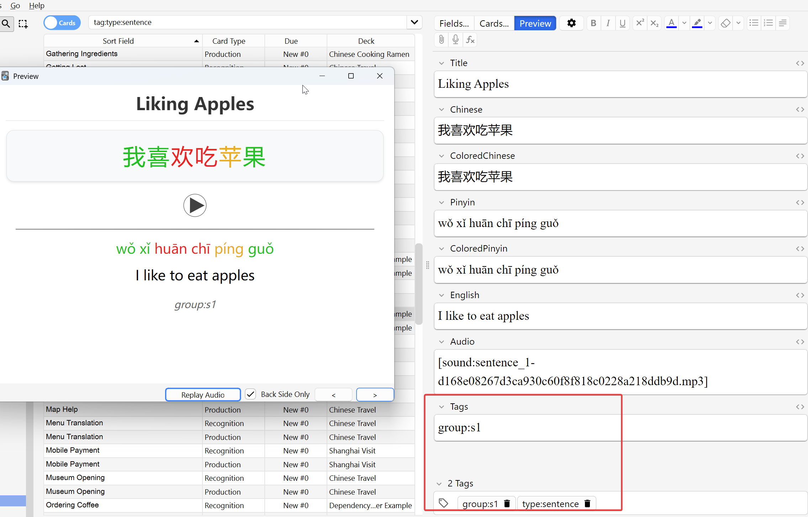
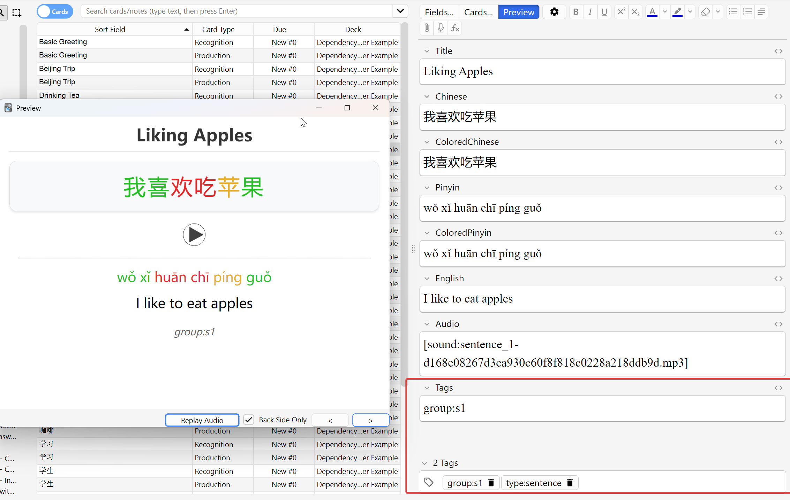

# Dependency Booster for Anki

<!-- HEADER BANNER -->

*Boost your language learning efficiency by automatically rescheduling forgotten vocabulary when you struggle with sentences.*

  
  
  
  

---

## Overview

Dependency Booster improves language learning by automatically identifying and rescheduling vocabulary cards that you've forgotten when reviewing sentence cards. When you fail to remember a sentence, the add-on reschedules the related vocabulary to appear sooner, ensuring you strengthen your foundations.

> **Example Deck**: Download our [example Chinese deck](./dist/dependency_booster_example.apkg) to quickly see how the add-on works with properly tagged vocabulary and sentence cards.

<!-- WORKFLOW DIAGRAM -->
![Workflow diagram showing the complete dependency boosting process. A flowchart with colored boxes and arrows: Blue boxes represent vocabulary cards tagged with "type:vocab" and "group:s1", green boxes represent sentence cards tagged with "type:sentence" and "group:s1". Red arrows show the flow when a sentence card is failed, triggering the dependency boosting process (orange box). Purple arrows show vocabulary cards being rescheduled to appear in tomorrow's reviews. Chinese example characters "苹果" (apple) and "我喜欢吃苹果" (I like to eat apples) are used to illustrate the relationship.](./screenshots/workflow-diagram.png)

### Key Features

- **Tag-based Dependency Detection** - Links vocabulary to sentences using a simple tagging system
- **Automatic Boosting** - Reschedules vocabulary cards after you fail related sentences
- **AnkiDroid Support** - Process your mobile reviews when you return to desktop
- **Fully Configurable** - Set maturity thresholds, review history periods, and more

---

## How It Works

1. When you fail a sentence card during review, the add-on checks for vocabulary cards that are dependencies of that sentence.
2. If any dependent vocabulary cards are found and considered "mature" (default: 21+ days old), they will be rescheduled to appear in tomorrow's review.
3. This ensures that you review the foundation vocabulary before seeing the sentence again.

<!-- BEFORE/AFTER EXAMPLE -->

---

## Installation

### From AnkiWeb (Coming Soon)

1. In Anki, go to Tools → Add-ons → Get Add-ons...
2. Paste the code: [AnkiWeb code will be added when assigned]
3. Restart Anki

**Note:** This add-on is only compatible with Anki 25.x versions and is not tested with older versions.

### Manual Installation

1. Download the latest release zip file from [GitHub Releases](https://github.com/beniscoding/anki-dependency-booster/releases)
2. In Anki, go to Tools → Add-ons → Install from file...
3. Select the downloaded file
4. Restart Anki

---

## Card Tagging System

For the add-on to work properly, you need to tag your cards in a specific way:

1. Tag vocabulary cards with `type:vocab` and `group:sX` (where X is a number)
2. Tag sentence cards with `type:sentence` and `group:sX` (with matching group numbers)

<!-- TAGGING EXAMPLES SIDE BY SIDE -->

  
<strong>Vocabulary Card Tags</strong> &nbsp;&nbsp;&nbsp;&nbsp;&nbsp;&nbsp;&nbsp;&nbsp;&nbsp;&nbsp;&nbsp;&nbsp;&nbsp;&nbsp;&nbsp;&nbsp;&nbsp;&nbsp;&nbsp;&nbsp;&nbsp;&nbsp;&nbsp;&nbsp;&nbsp;&nbsp;&nbsp;&nbsp; <strong>Sentence Card Tags</strong>

  

    
    
  

### Example:
- Vocabulary card for "苹果" (apple): `type:vocab` + `group:s1`
- Sentence using that word "我喜欢吃苹果" (I like to eat apples): `type:sentence` + `group:s1`

When you fail the sentence card, the vocabulary card will be rescheduled if it's mature.

---

## Using the Add-on

### Manual Boosting

Go to Tools → Dependency Booster → Boost Dependencies to manually trigger the dependency boosting process.

<!-- MENU SCREENSHOT -->

### Automatic Boosting

The add-on can automatically boost dependencies when you complete a review session:

1. Enable the feature via Tools → Dependency Booster → Enable Auto-Boost After Review 
   (or through the Settings dialog)
2. After you exit a review session, any failed sentence cards will have their vocabulary dependencies rescheduled
3. You'll see a notification when this process completes

### AnkiDroid Compatibility

While this add-on only runs on desktop Anki, we've included a special feature for AnkiDroid users:

1. Review your cards on AnkiDroid as usual
2. When you're back at your desktop, open Anki
3. Go to Tools → Dependency Booster → Sync & Boost AnkiDroid Reviews
4. This will:
   - Sync with AnkiWeb to get your latest AnkiDroid reviews
   - Process any failed sentence cards
   - Reschedule the vocabulary dependencies
   - Sync back to AnkiWeb so your changes appear on AnkiDroid

---

## Configuration

### Settings Dialog

Access the settings by going to Tools → Dependency Booster → Settings. The dialog allows you to:

<!-- SETTINGS SCREENSHOT -->
![Screenshot of the Dependency Booster settings dialog with annotations. The dialog shows all configurable options: A slider for "Minimum card age (days)" set to 21, with a note explaining this is the maturity threshold. A field for "Days to check for failed sentences" set to 7. A checkbox for "Enable automatic boosting after review sessions" that is checked. A button labeled "Clear processed review history" at the bottom. Each setting has a brief annotation explaining its purpose. The dialog uses Anki's standard UI style with a clean layout.](./screenshots/settings-dialog.png)

- **Minimum card age**: How old a vocabulary card must be before it's eligible for boosting (default: 21 days)
- **Days to check**: How far back to look for failed sentence cards (default: 7 days)
- **Auto-boost**: Enable/disable automatic boosting after review sessions
- **Clear processed reviews**: Reset the history of processed review logs

### Advanced Configuration

The add-on's configuration can also be modified directly through Anki's add-on configuration screen:

1. Go to Tools → Add-ons
2. Select "Dependency Booster"
3. Click "Config"

Available settings include:

- `maturity_threshold`: Days before a card is considered "mature" (default: 21)
- `detection_method`: How dependencies are identified (currently only tag-based)
- `days_to_check`: Number of days to look back for failed cards (default: 7)
- `auto_boost_enabled`: Whether to automatically boost after exiting review

---

## Creative Use Cases

While designed for language learning, our tagging system can be adapted for many learning domains:

### Medical Education
- **Foundational cards** (`type:vocab` + `group:m1`): Anatomy terms, pathophysiology concepts
- **Clinical cases** (`type:sentence` + `group:m1`): Patient presentations, diagnostic scenarios

### Mathematics
- **Concept cards** (`type:vocab` + `group:math3`): Formulas, theorems, definitions 
- **Problem cards** (`type:sentence` + `group:math3`): Complex problem-solving examples

---

## Compatibility

- **Tested with:** Anki 25.02 (Qt 6.6.2)
- **Important note:** This version is not tested with older Anki 2.1.x versions and may not be compatible
- **AnkiDroid compatibility:** Works with AnkiDroid reviews when synced back to desktop

---

## Support & Bug Reporting

If you encounter any issues or have suggestions, please visit:
- [GitHub Issues Page](https://github.com/beniscoding/anki-dependency-booster/issues)
- [Source Code Repository](https://github.com/beniscoding/anki-dependency-booster)

If you find this add-on useful and would like to support its development:

---

## License

This add-on is released under the MIT License.